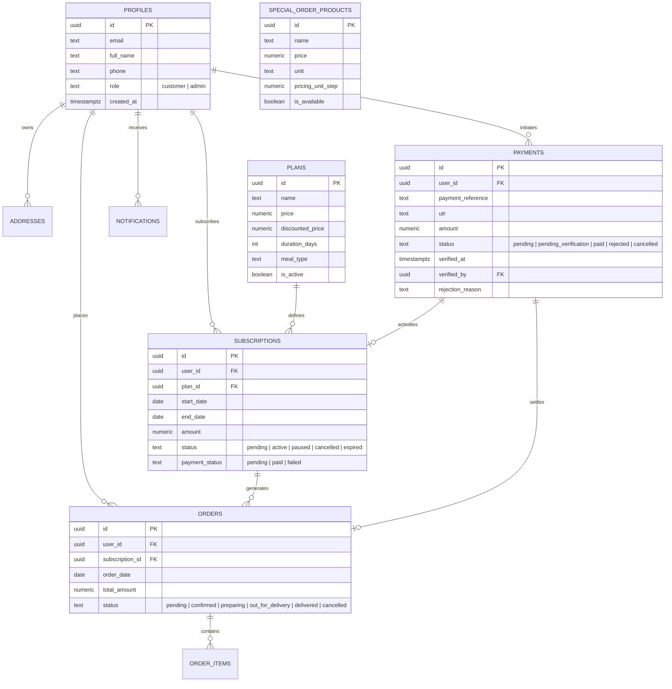
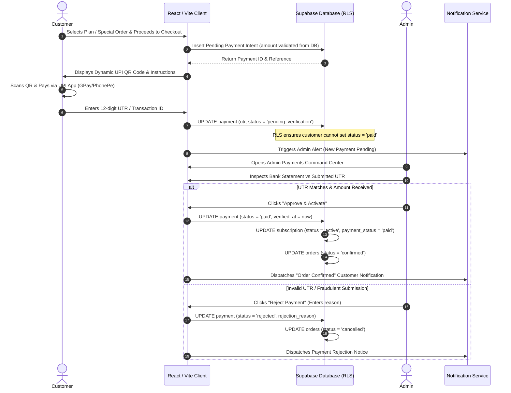

# System Architecture Documentation — Nimje Gharchi Rasoi

This document details the end-to-end software architecture, security boundaries, database design, payment flows, and deployment model for **Nimje Gharchi Rasoi**, an authentic homestyle tiffin and mess subscription platform tailored for Nagpur, Maharashtra.

---

## 1. High-Level System Architecture

```mermaid
flowchart TD
    subgraph ClientLayer ["Client Layer (Browser / Mobile PWA)"]
        UserBrowser["Customer Web App\n(React 19 + Vite + Tailwind)"]
        AdminBrowser["Admin Command Center\n(React 19 + Protected Route)"]
    end

    subgraph EdgeCDN ["Edge & CDN Layer (Vercel)"]
        VercelEdge["Vercel Edge Network\n(SPA Rewrites + Security Headers + Asset CDN)"]
    end

    subgraph BackendLayer ["Backend as a Service (Supabase)"]
        SupaAuth["Supabase Auth\n(JWT + Session Persistence)"]
        PostgresDB["PostgreSQL Database\n(Tables + Indexes + Triggers)"]
        RLSLayer["Row Level Security (RLS)\n(Authoritative Enforcement)"]
        EdgeFuncs["Supabase Edge Functions\n(Notification Webhooks / Alert Dispatch)"]
    end

    subgraph ExternalServices ["External Services"]
        UPIApps["UPI Payment Apps\n(GPay, PhonePe, Paytm, BHIM)"]
        ResendMail["Resend Email API\n(Order Confirmed & Alert Emails)"]
        SMSGateway["Fast2SMS / Twilio\n(Customer & Admin SMS)"]
    end

    UserBrowser -->|HTTPS / Assets| VercelEdge
    AdminBrowser -->|HTTPS / Assets| VercelEdge
    UserBrowser -->|Auth & Queries| SupaAuth
    UserBrowser -->|PostgREST (RLS Guarded)| RLSLayer
    AdminBrowser -->|Admin APIs (RLS Definered)| RLSLayer
    RLSLayer --> PostgresDB
    UserBrowser -->|UPI DeepLink / QR| UPIApps
    PostgresDB -->|Triggers / Logs| EdgeFuncs
    EdgeFuncs --> ResendMail
    EdgeFuncs --> SMSGateway
```

---

## 2. Frontend Architecture & Component Structure

The frontend is built using **React 19**, **TypeScript**, **Vite**, and **Tailwind CSS**. It follows a modular directory layout:

```
src/
├── components/
│   ├── auth/            # AuthModal, ProtectedRoute, AdminRoute
│   ├── layout/          # Navbar, Footer
│   ├── sections/        # Hero, MealPlans, WeeklyMenu, DeliveryZoneMap, KitchenGallery
│   └── ui/              # Button, Input, Card, Modal, Badge, Tabs, Dialog
├── context/
│   └── AuthContext.tsx  # Supabase Auth state, Session, User Profile, Role management
├── lib/
│   ├── rateLimit.ts     # Action throttling (sliding window token bucket)
│   ├── upi.ts           # NPCI standard UPI QR & URI generation, reference hashing
│   ├── utils.ts         # Class merging & general utilities
│   ├── validations.ts   # Client & server validation schemas
│   └── supabase/
│       └── client.ts    # Supabase singleton client instance
├── pages/
│   ├── HomePage.tsx               # Landing page, USP, menus, delivery zones, reviews
│   ├── MenuPage.tsx               # Complete Maharashtrian weekly rotating menu
│   ├── PlansPage.tsx              # Subscription plan selector & pricing
│   ├── SpecialOrdersPage.tsx      # Add-on dishes, custom kilograms, extra rotis
│   ├── CheckoutPage.tsx           # Address selection, delivery time slots, order summary
│   ├── PaymentPage.tsx            # Dynamic UPI QR, payee details, UTR input modal
│   ├── CustomerDashboardPage.tsx  # Active subscriptions, order tracking, review CTAs
│   ├── ContactPage.tsx            # Kitchen location, WhatsApp links, inquiry form
│   ├── LoginPage.tsx / SignupPage.tsx # Auth pages with redirect query support
│   └── admin/
│       ├── AdminDashboardPage.tsx     # Revenue metrics, active orders, live summary
│       ├── AdminOrdersPage.tsx        # Order status pipeline (Confirmed -> Delivered)
│       ├── AdminPaymentsPage.tsx      # UTR verification modal, Approve/Reject logic
│       ├── AdminSubscriptionsPage.tsx # Customer plan management & renewal alerts
│       ├── AdminMenuPage.tsx          # Dynamic weekly menu items editor
│       ├── AdminSpecialOrdersPage.tsx # Addon dish inventory & pricing management
│       ├── AdminPlansPage.tsx         # Subscription duration & tier pricing editor
│       └── AdminSettingsPage.tsx      # UPI ID, payee name, cutoff timings
├── services/
│   ├── adminService.ts         # Admin payment approval/rejection, metrics queries
│   ├── notificationService.ts  # In-app alerts, WhatsApp formatters, webhook dispatch
│   └── paymentService.ts       # Intent creation, UTR submissions, IST date calculations
└── types/
    └── database.ts             # TypeScript definitions matching Supabase schema
```

---

## 3. Database Schema & Relational Model



---

## 4. Payment & UTR Verification Lifecycle



---

## 5. Security Model & Client Trust Boundaries

### Untrusted Client Boundaries
Under no circumstances does the application trust financial values, activation flags, or administrative commands supplied directly by the client browser:

| Operation | Client Role Capability | Authoritative Server/Database Enforcement |
| :--- | :--- | :--- |
| **Payment Status Modification** | Can only transition `pending` → `pending_verification` | RLS prevents setting `status = 'paid'` or modifying `verified_at` / `verified_by`. |
| **Subscription Activation** | Can only create `pending` subscriptions | Only `is_current_user_admin()` can update `status` to `'active'` or modify dates. |
| **Order Item Pricing** | Submits product ID and desired quantity | Pricing is queried directly from `plans` and `special_order_products`. Client-submitted unit prices are discarded. |
| **User Role Escalation** | Can update full name and phone in `profiles` | RLS `WITH CHECK` enforces `role = 'customer'` for non-admins. |
| **Data Isolation (IDOR)** | Can only query records matching `auth.uid() = user_id` | RLS prevents cross-tenant data access across all tables. |
| **Admin Route Direct Access** | Redirected to `/login` by `<AdminRoute>` | Even if URL is forged, PostgREST queries fail with empty datasets due to `is_current_user_admin()` RLS checks. |

---

## 6. Timezone Handling (Asia/Kolkata)

The application is engineered exclusively for Indian operations. Calendar dates for subscription commencement, duration intervals, and meal cutoff times utilize `Asia/Kolkata` (IST):

- **Helper**: `getIstDateString()` leverages `Intl.DateTimeFormat('en-CA', { timeZone: 'Asia/Kolkata' })` to generate standard `YYYY-MM-DD` strings.
- **Midnight Boundary Defense**: Prevents the standard UTC regression bug between `00:00` and `05:30` IST where naive UTC dates fall back to the prior day.
